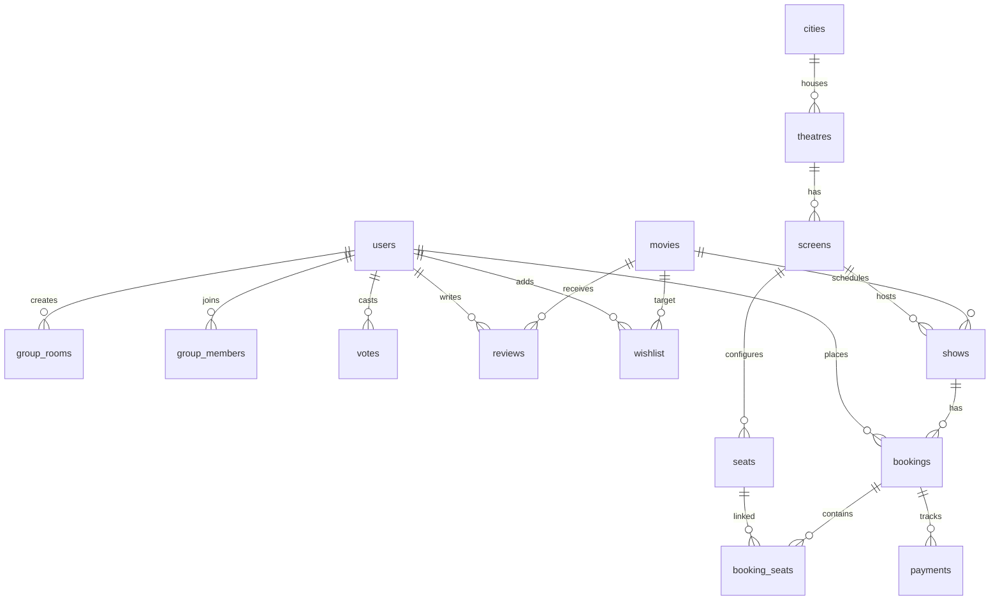

# CineCircle 🎬

CineCircle is a premium, production-ready, full-stack movie ticket booking platform that solves group coordination difficulties. While traditional booking applications focus exclusively on individual bookings, CineCircle introduces a unique **Collaborative Group Movie Planning System** featuring shared invite codes, real-time voting (on movies, theatres, and showtimes), and coordinated seat selections.

Designed with a premium dark cinematic aesthetic (Netflix + IMAX inspired), this project is **DBMS-viva ready**, featuring a highly robust relational schema, full type safety, and a **Dual Database Fallback engine** that runs instantly without external database configurations.

---

## 🚀 Unique Selling Point (USP)

### Group Movie Planning System
1. **Create Group Room**: Click "Plan in Group" from any movie card. Generates a 6-character room code.
2. **Invite Friends**: Share the secure link `http://localhost:3000/group/:inviteCode`.
3. **Vote Movie**: Members vote on the pool of Now Showing films.
4. **Vote Theatre & Showtime**: Members vote on preferred cinema locations and schedules.
5. **Interactive Results**: Dynamic animated progress bars display real-time member consensus.
6. **Coordinated Seats**: Select seats together on the interactive screen matrix.
7. **Book & Confirm**: Instantly simulated payments generate downloadable cinematic passes.

---

## 📊 DBMS Viva Presentation Guide (DB Schema)

CineCircle features a high-fidelity relational database structure suitable for academic viva and industry presentations.

### Relational Schema Diagram (Mermaid ER)



### Database Tables Descriptions

1. **`users`**: Customer and Admin records.
   - Primary Key: `id` (Serial)
   - Unique constraints: `email`
   - Attributes: `password_hash`, `full_name`, `role` (`user` | `admin`), `profile_pic`
2. **`cities`**: Persistence for India location-based routers.
   - Primary Key: `id` (Serial)
   - Unique constraints: `slug`
3. **`movies`**: Titles metadata catalog.
   - Primary Key: `id` (Serial)
   - Attributes: `title`, `genre`, `language`, `duration_mins`, `rating` (`U`, `UA`, `A`), `poster_url`, `is_now_showing`
4. **`theatres`**: Cinemas locations records.
   - Foreign Key: `city_id` references `cities.id` (1:N cascade)
5. **`screens`**: Screen halls inside specific theatres.
   - Foreign Key: `theatre_id` references `theatres.id` (1:N cascade)
   - Attributes: `type` (`IMAX` | `2D` | `3D`)
6. **`shows`**: Showtime schedule slots matching movies to screens.
   - Foreign Keys: `movie_id` references `movies.id`, `screen_id` references `screens.id`
7. **`seats`**: Coordinated layout matrices.
   - Category attribute: `Regular` | `Premium` | `Recliner` (pricing derived on booking)
8. **`bookings`**: Customer ticket orders.
   - Unique Ticket Code constraint: `code`
9. **`booking_seats`**: Junction table mapping seats booked per ticket (N:M link).
   - Composite Primary Key: `(booking_id, seat_id)`
10. **`payments`**: Simulated Razorpay API references tracking `razorpay_order_id`, transaction status, and timestamps.
11. **`group_rooms`**: Collaborative session metadata.
12. **`votes`**: Member preference tallies linking voters to specific choice IDs (movies, theatres, times).

---

## 🛠️ Ideal Tech Stack

- **Frontend**: React (Vite), TypeScript, Tailwind CSS, Lucide Icons, React Router DOM, Zustand.
- **Backend**: Node.js, Express.js, TypeScript, jsonwebtoken, bcryptjs, dotenv.
- **Database ORM**: Drizzle ORM (PostgreSQL client).
- **Dual Engine Fallback**: Integrates a pure TypeScript file-based persistence DB (`db.json`) that replicates SQL queries perfectly. If `DATABASE_URL` is empty, the application falls back to this mode, meaning **it compiles and runs instantly without needing a running PostgreSQL instance!**

---

## 🏃 Quick Start Guide

### 1. Installation
Ensure Node.js is installed on your computer. Open your terminal at the project root directory (`c:\Users\CSC\OneDrive\Desktop\movie`) and run:
```bash
# Installs root, frontend, and backend packages in one linked command
npm run install:all
```

### 2. Launch Local Dev Servers
Once packages are installed, launch both servers in parallel:
```bash
# Spins up Backend on port 5000 and Frontend on port 3000 concurrently
npm run dev
```

Open your browser and navigate to **`http://localhost:3000`** to view the application!

### 🔑 Seed Login Portals
The local fallback database automatically seeds itself with default mock accounts:
- **Administrator Panel Access**:
  - **Email**: `admin@cinecircle.com`
  - **Password**: `admin123`
- **Standard Customer Account**:
  - **Email**: `user@cinecircle.com`
  - **Password**: `user123`

---

## ☁️ Production Deployment Instructions

### 1. Database (Neon PostgreSQL)
1. Register a free Serverless PostgreSQL instance on **[Neon.tech](https://neon.tech)**.
2. Under Connection Details, copy your Connection String (`postgres://...`).
3. Set this string as `DATABASE_URL` inside your backend environment config.
4. Run `npm run db:seed --prefix backend` to seed PostgreSQL with all 15 movies, theatres, and screens!

### 2. Backend (Render / Heroku)
1. Create a free Web Service on **[Render](https://render.com)**.
2. Link your GitHub repository.
3. Configure the following build environment:
   - **Root Directory**: `backend`
   - **Build Command**: `npm install && npm run build`
   - **Start Command**: `npm start`
4. Declare Environment Variables:
   - `DATABASE_URL`: Your Neon connection string.
   - `JWT_SECRET`: A secure long random string.
   - `JWT_REFRESH_SECRET`: A secure long random string.
   - `PORT`: `5000` (Render handles this dynamically).

### 3. Frontend (Vercel / Netlify)
1. Create a project on **[Vercel](https://vercel.com)**.
2. Link your repository.
3. Configure:
   - **Root Directory**: `frontend`
   - **Build Command**: `npm run build`
   - **Output Directory**: `dist`
4. Set base Axios URLs (`frontend/src/services/api.ts`) to point to your live Render API URL instead of `http://localhost:5000/api`.
5. Deploy! Your site is live!
